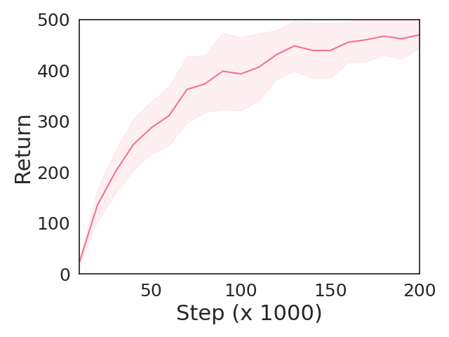
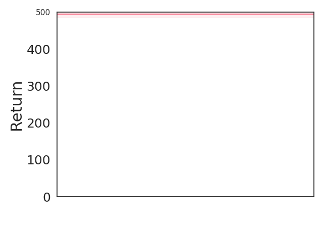
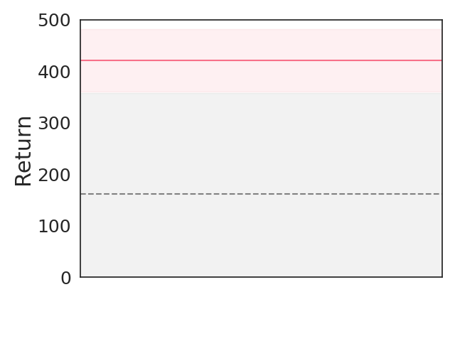
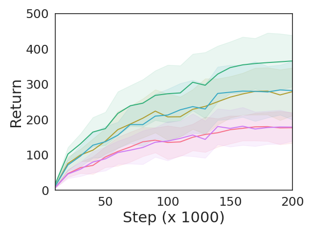
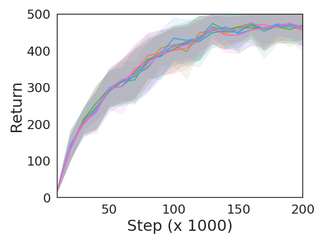

Generalised UDRL
================
[](LICENSE.md)

[All You Need Is Supervised Learning: From Imitation Learning to Meta-RL With Upside Down RL](https://arxiv.org/abs/2202.11960)

Implementation of a generalised UDRL agent. Supports online RL, imitation learning, offline RL, goal-conditioned RL, and meta-RL:
```sh
python main.py --mode [online|imitation|offline|goal|meta]
```

Note that some implementation decisions were made for simplicity, and hence do not reflect an implementation that works across all modes simultaneously.

Requirements
------------

Requirements can be installed with:
```sh
pip install -r requirements.txt
```

Results
-------

Online                        | &nbsp;&nbsp;IL&nbsp;&nbsp;&nbsp;    | Offline                         | &nbsp;GCRL&nbsp;&nbsp;    | Meta-RL
:----------------------------:|:-----------------------------------:|:-------------------------------:|:-------------------------:|:-------------------------:
 |  |  |  | 

Citation
--------

```tex
@inproceedings{arulkumaran2022all,
  author = {Arulkumaran, Kai and Ashley, Dylan R. and Schmidhuber, Jürgen and Srivastava, Rupesh K.},
  title = {All You Need is Supervised Learning: From Imitation Learning to Meta-RL with Upside Down RL},
  booktitle = {Multi-disciplinary Conference on Reinforcement Learning and Decision Making},
  year = {2022}
}
```
